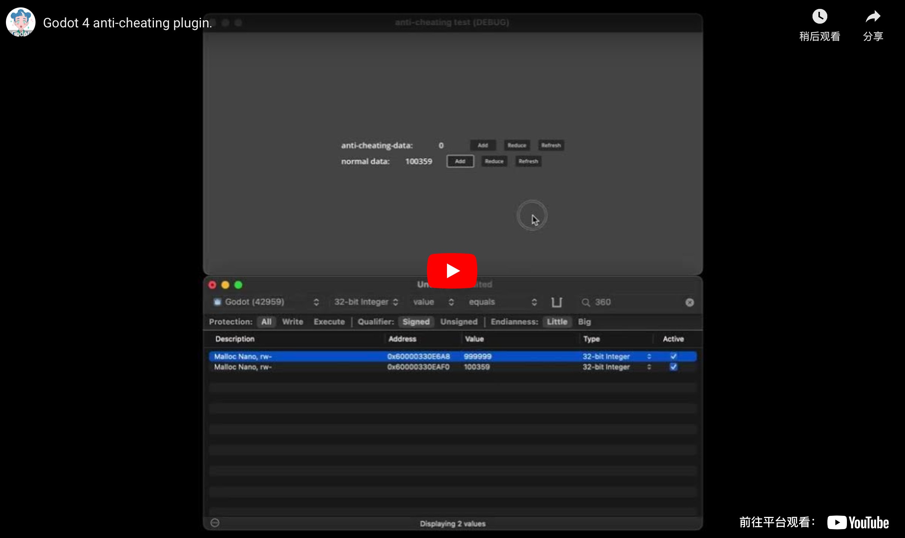

# Anti-Cheat Value Plus Plugin

The **Anti-Cheat Value Plus Plugin** is designed to protect sensitive in-game data from being modified by cheat tools. It uses obfuscation techniques and runtime validation to secure data integrity.

---

## Features

- **Obfuscated Data Storage**: Safeguards sensitive data by storing it in an obfuscated form.
- **Runtime Validation**: Ensures values remain unaltered during gameplay.
- **Flexible Data Types**: Supports multiple data types, including integers, floats, strings, arrays, dictionaries, and booleans.

---

## How to Use

### Step 1: Enable the Plugin
1. Open your Godot project.
2. Go to **Project Settings** > **Plugins**.
3. Locate the **Anti-Cheat Value Plus Plugin** and enable it.

---

### Step 2: Initialize the Anti-Cheat Pool
Before using the plugin, initialize the anti-cheat pool in your script:

```gdscript
var my_anticheat_pool: ac_node = acGlobalPool
```

The acGlobalPool acts as the central storage for all anti-cheat values.


---

### Step 3: Set the disturb level of your pool:

```gdscript
my_anticheat_pool.disturb = 5
```

And now whenever a value is added to the pool, the appropriate amount of noise will be produced within to obfuscate it. These are automatically managed so if you change the value or erase it, the noise copies will follow suit.


---

###Step 4: Create and Manage Anti-Cheat Values

# The plugin provides specialized classes for different data types. Use these classes to create anti-cheat-protected variables:

ac_int: For integers.

ac_float: For floats.

ac_string: For strings.

ac_list: For arrays or dictionaries.

ac_bool: For booleans.


Example usage:

```gdscript
# Create a protected integer
var protected_int = ac_int.new(42)

# Add the protected integer to the global pool
my_anticheat_pool.set_value("my_protected_int", protected_int)

# Access the protected value
var value = my_anticheat_pool.get_value("my_protected_int").value()
print(value)  # Outputs: 42
```

---

###Step 5: Accessing and Modifying Values

# Access and modify values using the set_value and get_value methods:

```gdscript
#Set a Value:

my_anticheat_pool.set_value("key_name", ac_value_instance)

#Get a Value:

var value = my_anticheat_pool.get_value("key_name").value()

#Parse a list (ac_list)

var value = my_anticheat_pool.get_value("my_list").parse()
```

---

###Additional Feature: Assimilate

#Easily merge your dictionaries into the pool with the assimilate method:
```gdscript
var dictionary = {"example1": "value1", "example2": 123, "example4": true}

my_anticheat_pool.assimilate(dictionary)

# This will now be an ac_string
var example1 = my_anticheat_pool.get_value("example1").value()

# Prints "value1"
print(example1)
```
---

##Performance Considerations

Using the Anti-Cheat Value Plugin introduces a small performance overhead due to its validation processes. Use it only for sensitive data to balance security and performance.


---

##Additional Notes

The plugin supports both dictionaries and arrays as nested structures, stored and accessed through ac_list.

The acGlobalPool serves as a shared resource; initialize and use it consistently across your project.

The anti-cheat variables are accessed in the form of key-value pairs, so please ensure the uniqueness of the keys to avoid mistakenly overwriting the correct data.

[](https://youtu.be/lVJk9zAZP1w)